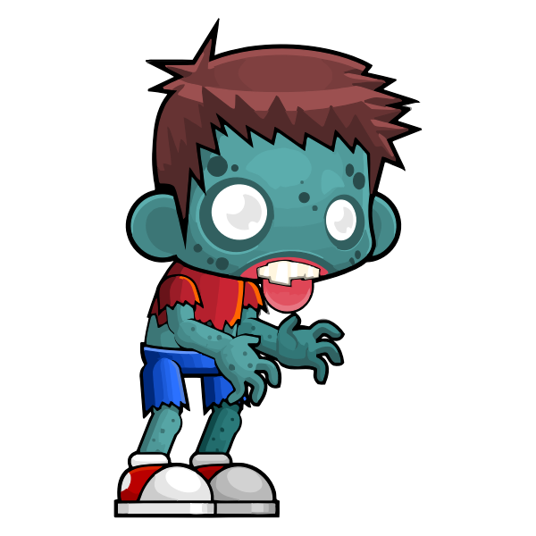
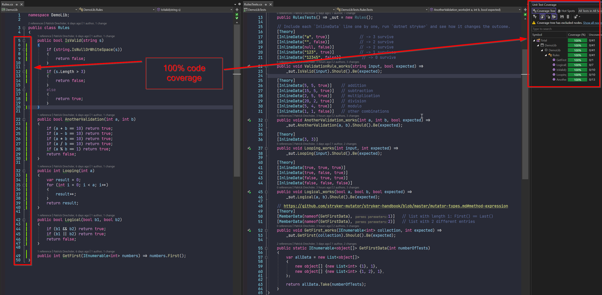
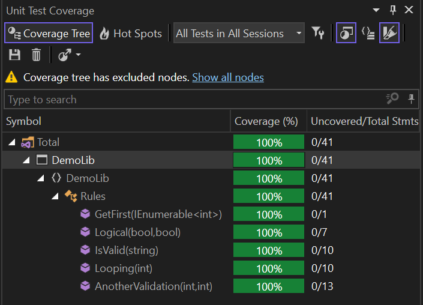

---
# try also 'default' to start simple
theme: ./mathema-2021

# infos for the footer (on slides with the default-with-footer layout)
company: "MATHEMA"
presenter: ""
contact: "patrick.drechsler@mathema.de"

# apply any windi css classes to the current slide
class: 'text-center'

highlighter: shiki

# some information about the slides, markdown enabled
info: |
  ## Mutation Testing

# persist drawings in exports and build
drawings:
  persist: false
---

# Mutation Testing

### Patrick Drechsler



---

### Code Coverage 100%




---

### Code Coverage 100%

what more do you want?




---
layout: my-two-cols
---

::top::

### Example

::left::

```csharp
public class Rules
{
  public bool IsValid(string s)
  {
    if (string.IsNullOrWhiteSpace(s))
    {
      return false;
    }

    if (s.Length > 3)
    {
      return false;
    }

    return true;
  }
}
```

::right::

```csharp
public class RulesTests
{
  private readonly Rules _sut;
  
  public RulesTests() => _sut = new Rules();

  [Theory]
  [InlineData("", false)]
  [InlineData("a", true)]
  [InlineData("12345", true)]  
  public void Validation_works(
    string input, bool expected) => 
    _sut.IsValid(input).Should().Be(expected);
}
```

::bottom::

- 100% coverage...
- but, are we covering all corner cases?

---
layout: image-right
image: "content/images/cabeca-zumbi.png"
---

### Let's create some mutants!

Let's change

```csharp
if (s.Length > 3)
```

to

```csharp
if (s.Length < 3)  // <- this is a "MUTANT"
```

```csharp
if (s.Length >= 3) // <- this is another "MUTANT"
```


```csharp
if (s.Length <= 3) // <- ...and another "MUTANT"
```

Do we still have the same code coverage?


---
layout: image-right
image: "content/images/zombie-4659324_1280.webp"
---

### Concept

- Production code is modified (by the mutation testing framework)
- Test suite is run

Did any mutants survive?

- If all mutants die, the test suite is fine 👌
- But if some mutants survive, the tests are not covering all cases 👀
  - 👉 take a closer look

Many mutation frameworks generate an interactive html report

---
layout: iframe-right
url: https://stryker-mutator.io/docs/stryker-net/mutations/
---

### Example mutations

https://stryker-mutator.io/docs/stryker-net/mutations/


---
layout: image
image: "content/images/zombie_the_walking_dead_undead_dead_monster_death_burned_horror-603211.jpg!d"
---

### Live Demo: Mutation Testing in C#

---

## Other languages

Frameworks are available for many languages:

- ⚗️ Java (using [PIT](https://pitest.org/))
- Scala (using [Stryker4s](https://stryker-mutator.io/docs/stryker4s/getting-started/))
- ⚗️ C# (using [Stryker.NET](https://stryker-mutator.io/docs/stryker-net/introduction/))
- ⚗️ Javascript/Typescript (using [StrykerJS](https://stryker-mutator.io/docs/stryker-js/introduction/))
- ⚗️ Python (using [Cosmic Ray](https://cosmic-ray.readthedocs.io/) or [mutmut](https://mutmut.readthedocs.io/))
- Haskell (using [MuCheck](https://hackage.haskell.org/package/MuCheck))
- ...

⚗️: Example project in the repo


---


## Mutation Testing: Summary

- requires decent test coverage
- modifies production code to find corner cases
- requires a lot of resources: use deliberately!
- Don't include it in your CI/CD pipeline
- Use it as an exploratory tool to find bugs in your code
- Use it to find critical bugs in your code

<!-- horizontal flip of image -->
<style>
  img {
    -webkit-transform: scaleX(-1);
    transform: scaleX(-1);
  }
</style>

---
layout: image-right
image: "/content/images/zombie-5160026_1280.webp"
---

### The End

Any Questions?